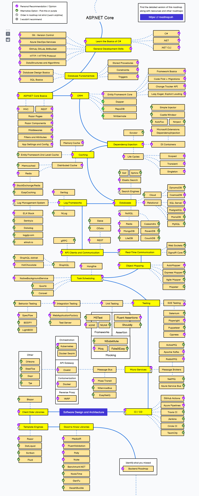

# GSCare

```Cuidar do seu cliente é cuidar da sua empresa.```

GSCare é um sistema backend robusto desenvolvido em .NET 8 utilizando C#, Entity Framework, Dapper, Clean Code e Domain-Driven Design (DDD). O sistema é voltado para o acompanhamento e gerenciamento de clientes e funcionários em empresas prestadoras de serviços, como clínicas e profissionais de saúde. Entre suas funcionalidades, destacam-se o gerenciamento de pacientes, funcionários, agendamentos de calendário, e o armazenamento de fotos e arquivos. O GSCare será oferecido como um Software como Serviço (SaaS).

## 🚀 Começando

Este guia fornecerá instruções para obter uma cópia do projeto em operação na sua máquina local para fins de desenvolvimento e teste.

### 📋 Pré-requisitos

Antes de começar, você precisará ter instalado na sua máquina:

- **.NET 8 SDK**: [Instalar .NET 8](https://dotnet.microsoft.com/download/dotnet/8.0)
- **MySQL**: Para banco de dados. [Instalar MySQL](https://dev.mysql.com/downloads/)
- **Node.js**: Necessário para gerenciar dependências do frontend (se aplicável). [Instalar Node.js](https://nodejs.org/)

### 🔧 Instalação

Siga os passos abaixo para configurar o ambiente de desenvolvimento:

1. **Clone o repositório:**

   ```bash
   git clone https://github.com/feh-franc0/GSCare.git
   cd GSCare
   ```

2. **Restaure as dependências:**

   Navegue até a pasta do projeto e execute o comando:

   ```bash
   dotnet restore
   ```

3. **Configurar o banco de dados:**

   Crie um banco de dados MySQL e configure a string de conexão no arquivo `appsettings.json` dentro da pasta `GscareApiAspNetCore.Api`.

   ```json
    {
      "ConnectionStrings": {
        "Connection": "Server=localhost;Database=gscare_db;User=root;Password=your_password;"
      },
      "Settings": {
        "Jwt": {
          "SigningKey": "wwwwwwwwwwwwwwwwwwwwwwwwwwwwwwww",
          "ExpirationTimeMinutes": 1000
        }
      }
    }

   ```

4. **Execute as migrações:**

   Execute o comando para aplicar as migrações e configurar o banco de dados:

   ```bash
   dotnet run --project src/GscareApiAspNetCore.Api
   ```

   As migrações serão aplicadas automaticamente utilizando Dapper e FluentMigrator.

5. **Inicie o servidor:**

   Após configurar o banco de dados, inicie o servidor localmente:

   ```bash
   dotnet run --project src/GscareApiAspNetCore.Api
   ```

   O sistema estará disponível em `http://localhost:5000`.

### ⚙️ Executando os testes

No momento, os testes estão sendo desenvolvidos e serão adicionados na fase final do projeto. Os testes cobrirão todos os cenários críticos de negócios para garantir a robustez do sistema.

### 🖼️ Swagger e Roadmap

- **Swagger UI**: Acesse a documentação interativa da API através do Swagger:

  <!---->
  <details>
     <summary style="cursor: pointer; font-weight: bold; color: #007bff; background-color: #f8f9fa; padding: 10px; border-radius: 5px;">
       📸 Clique aqui para visualizar a imagem do Swagger
     </summary>
     
   </details>


  O Swagger UI estará disponível em `https://localhost:7053/swagger/index.html`.

- **Roadmap .NET**: Aqui está um exemplo de roadmap que pode ajudar no aprendizado de .NET:

  <!---->
  <details>
     <summary style="cursor: pointer; font-weight: bold; color: #007bff; background-color: #f8f9fa; padding: 10px; border-radius: 5px;">
       📸 Clique aqui para visualizar a imagem do Roadmap
     </summary>
     
   </details>

### 🛠️ Arquitetura

O GSCare é construído seguindo os princípios de Clean Architecture e Domain-Driven Design (DDD), garantindo uma estrutura sólida, escalável e de fácil manutenção.

- **Clean Architecture**: A separação clara das responsabilidades nas diferentes camadas do projeto permite que as alterações em uma camada não afetem as outras. Isso promove um código mais limpo e fácil de manter.

  <!---->
  <details>
     <summary style="cursor: pointer; font-weight: bold; color: #007bff; background-color: #f8f9fa; padding: 10px; border-radius: 5px;">
       📸 Clique aqui para visualizar a imagem sobre Clean Architecture
     </summary>
     
   </details>

  **Resumo:** A Clean Architecture organiza o código em camadas, como a de domínio, aplicação e infraestrutura, promovendo uma alta coesão e baixo acoplamento.

- **DDD (Domain-Driven Design)**: Focamos na modelagem de negócios real através de entidades, agregados e serviços de domínio. Isso garante que a lógica de negócios seja clara, bem definida e diretamente refletida no código.

  <!---->
  <details>
     <summary style="cursor: pointer; font-weight: bold; color: #007bff; background-color: #f8f9fa; padding: 10px; border-radius: 5px;">
       📸 Clique aqui para visualizar a imagem sobre DDD
     </summary>
     
   </details>

### 📦 Implantação

Para implantar o GSCare em um ambiente de produção, siga os passos abaixo:

1. **Configuração de Ambiente:**
   - Configure a string de conexão do banco de dados no arquivo `appsettings.Production.json`.
   - Configure variáveis de ambiente para armazenar chaves sensíveis.

2. **Publicação da Aplicação:**

   Utilize o comando `dotnet publish` para gerar os artefatos da aplicação:

   ```bash
   dotnet publish -c Release -o ./publish
   ```

3. **Implantação no Servidor:**

   - Copie os arquivos da pasta `./publish` para o servidor.
   - Configure o servidor web (IIS, Nginx, etc.) para servir a aplicação.

## 🛠️ Construído com

As principais ferramentas e bibliotecas utilizadas no projeto incluem:

- **.NET 8** - Framework principal.
- **C#** - Linguagem de programação.
- **Entity Framework Core** - ORM para acesso ao banco de dados.
- **Dapper** - Micro ORM para execução de queries SQL diretas.
- **FluentMigrator** - Ferramenta para gerenciar migrações de banco de dados.
- **MySQL** - Banco de dados relacional utilizado.
- **Swagger** - Para documentação da API.

## 🖇️ Colaborando

Se você deseja colaborar, por favor, leia o [COLABORACAO.md](https://gist.github.com/feh-franc0) para obter detalhes sobre o nosso código de conduta e o processo para enviar pull requests.

## 📌 Versão

Nós utilizamos [SemVer](http://semver.org/) para controle de versão. Atualmente, o projeto está na versão `1.0.0`. <!-- Para as versões disponíveis, veja as [tags neste repositório](https://github.com/feh-franc0/GSCare/tags).-->

## ✒️ Autores

* **Fernando Franco Valle** - *Desenvolvedor Principal* - [LinkedIn](https://www.linkedin.com/in/fernandofrancovalle/) | [GitHub](https://github.com/feh-franc0)

## 📄 Licença

Este projeto está em processo de validação e não é permitida a venda, comércio ou uso sem autorização expressa. Para mais detalhes, consulte o arquivo [LICENSE.md](LICENSE.md).

## 🎁 Expressões de gratidão

* Conte a outras pessoas sobre este projeto 📢;
* Agradeça publicamente 🫂;

---

⌨️ Por: [Fernando Franco Valle](https://www.linkedin.com/in/fernandofrancovalle/) 😊
